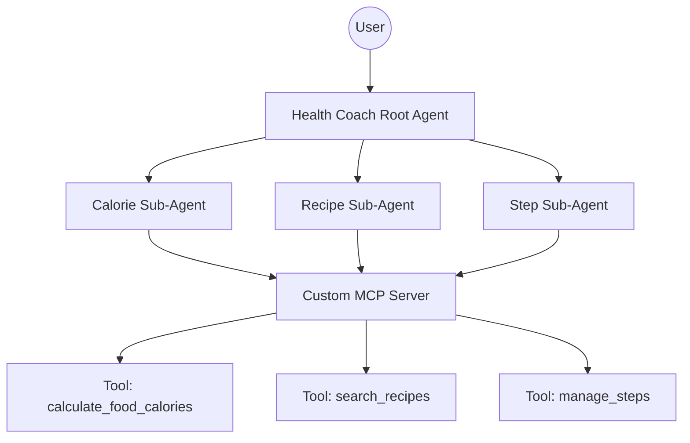

# Health Coach Agent 🏃‍♀️🥗

A multi-agent health coaching system built with the **Google Agent Development Kit (ADK)** and the **Model Context Protocol (MCP)**. This system orchestrates specialized sub-agents to provide a unified, friendly health coaching experience.

## 🌟 Features

- **Root Orchestrator**: A friendly Health Coach that understands complex user queries and delegates tasks to specialists.
- **Specialized Sub-Agents**:
    - **Calorie Agent**: Expert in nutritional profiles and calorie estimation.
    - **Recipe Agent**: A culinary chef that finds healthy recipes using the MealDB API.
    - **Step Agent**: A fitness tracker that logs and retrieves daily step counts.
- **Custom MCP Server**: A standalone tool server providing real-world capabilities to the agents.

## 🏗️ Architecture

The project follows a hierarchical agent architecture:



## 🚀 Getting Started

### Prerequisites
- Node.js 22+
- A `.env` file with your `GEMINI_API_KEY` configured.

### Installation
```bash
npm install
```

### Running the Agent
You can run the end-to-end orchestration script to test the agent's behavior:
```bash
npx tsx agent.ts
```

This script will simulate a user query and show the agents working together to provide a combined health plan.

## 🛠️ Project Structure

- `agent.ts`: The root orchestrator agent.
- `calorie_agent/`, `recipe_agent/`, `step_agent/`: Specialist sub-agent definitions.
- `mcp-server/`: The custom MCP server implementation.
    - `index.ts`: Server entry point.
    - `server.ts`: MCP server instance configuration.
- `tools/`: Individual tool implementations (Calories, Recipes, Steps).
- `shared/`: Shared configurations, including the toolset bridge.

## 🔧 MCP Tools

The system exposes three main tools via MCP:
1. `calculate_food_calories`: Returns kcal estimates for food items.
2. `search_recipes`: Fetches healthy recipes and instructions.
3. `manage_steps`: Tracks daily walking progress in-memory.

