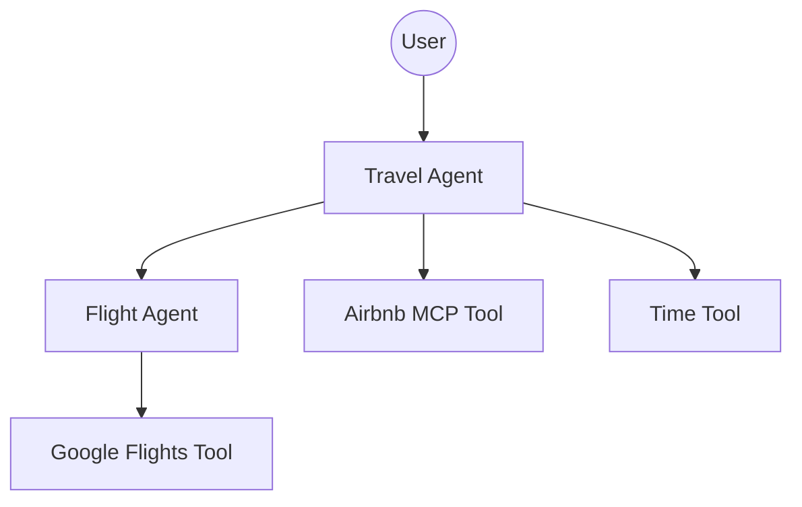

# ✈️ MCP Travel Agent Demo

A sophisticated travel planning assistant built with the [Google Agent Development Kit (ADK)](https://github.com/google/adk) and powered by **Gemini 2.5 Flash**. This project demonstrates how to orchestrate multiple specialized agents and integrate external services using the **Model Context Protocol (MCP)**.

## 🌟 Features

- **Root Travel Agent**: Orchestrates the planning process, managing high-level user requests and delegating tasks.
- **Specialized Flight Agent**: Dedicated sub-agent for finding flight options and generating booking links.
- **Airbnb Integration**: Leverages MCP to connect directly to Airbnb's data for real-time accommodation searches.
- **Context Awareness**: Built-in tools for time and location awareness to provide relevant travel advice.

## 🏗️ Architecture

The project follows a hierarchical agent architecture:



### Agents
- **Travel Agent (`root_agent`)**: The entry point. It handles general travel inquiries and uses the `Flight Agent` as a sub-agent when flight-specific information is needed.
- **Flight Agent (`flight_agent`)**: A specialized agent focused on flight logistics, providing direct Google Flights search links.

### Tools & Protocol
- **MCP (Model Context Protocol)**: Used to interface with the Airbnb MCP server (`@openbnb/mcp-server-airbnb`), allowing the agent to perform searches without custom API integrations.
- **Local Tools**: Custom Python functions for retrieving current time (`now`) and generating flight search URLs.

## 🚀 Getting Started

### Prerequisites
- Python 3.10+
- [Node.js](https://nodejs.org/) (for running MCP servers via `npx`)
- Google ADK installed: `pip install google-adk`
- A Gemini API Key configured in your environment.

### Installation

1. **Clone the repository**:
   ```bash
   git clone <repository-url>
   cd mcp-agent-demo
   ```

2. **Set up environment variables**:
   Create a `.env` file in the `mcp_agent` directory:
   ```env
   GOOGLE_API_KEY=your_api_key_here
   ```

3. **Install dependencies**:
   ```bash
   pip install -e .
   ```

## 🛠️ Usage

To launch the agent in the ADK Web UI:

```bash
adk web
```

This will start a local server (usually at `http://127.0.0.1:8000`) where you can interact with the Travel Agent through a chat interface.

## 📂 Project Structure

```text
.
├── mcp_agent/
│   ├── agent.py            # Root Travel Agent definition
│   └── flight_agent/
│       └── agent.py        # Flight sub-agent definition
└── README.md
```

---
*Built for AI Dev Camp London 2026*
